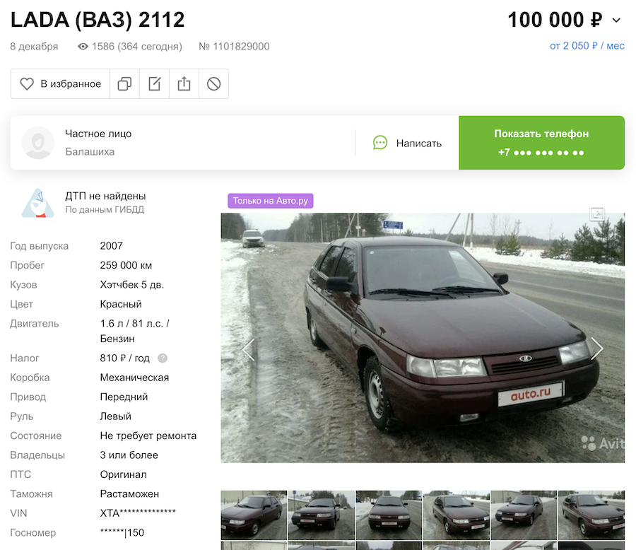
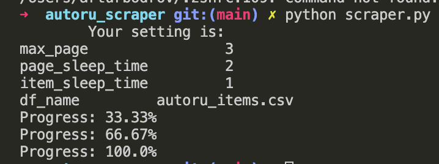
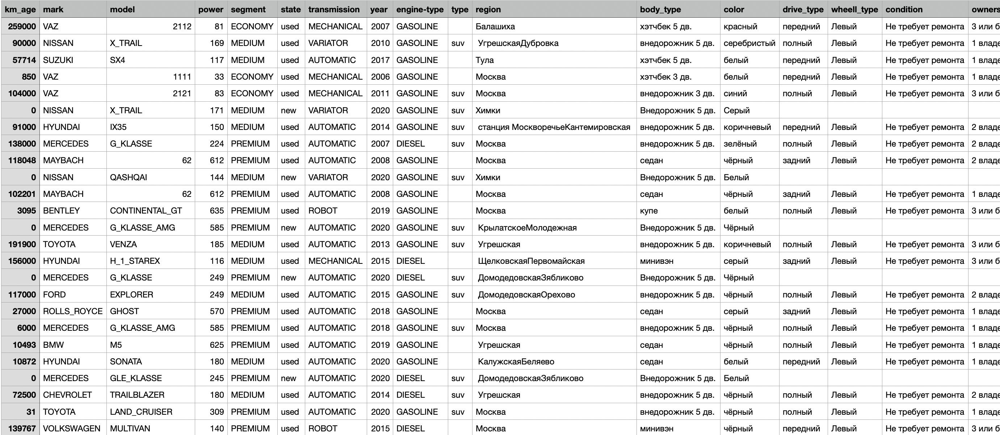

# Скрепер объявление с сайта Auto.ru

Автоматически собирает данные об объявлениях с сайта [Auto.ru](https://auto.ru/).

Пример, как это ⬇️ объявление переходит структурированную таблицу с данными.



Переходит в таблицу с данными.

| Пробег | Марка | Модель | Лошад. силы | Сегмент | Состояние | Коробка передач | Год выпуска | ... |
| :-- | :-- | :-- | :-- | :-- | :-- | :-- | :-- | :-- | 
| 259000 | VAZ | 2112 | 81 | ECONOMY | б/у | Механическая | 2007 |... |

# Как это работает

Приложение открывает страницу поиска и начинает собираться сслыка на объявление, чтобы открыть и собрать подробности об автомобиле.

После сбора сбора информации обо всех автомобилях на странице, скрипт сохраняет результат в файловую систему.

# Requirements
Перечень всех зависимостей в `requirements.txt`
```
appnope==0.1.0
attrs==19.3.0
autoscraper==1.1.10
backcall==0.2.0
beautifulsoup4==4.9.3
bleach==3.1.5
...
```

# Использование

Запускать скрипт надо из терминала 
```bash
python scraper.py
```

После запуска скрипт распечает настройки и начнет собирать данные, о прогрессе будет писать в терминал. Первый принт может занять несколько минут.



# Config
Скрепере настроивается через конфиг - `settings.json`.
```json
{
    "max_page": 3,
    "page_sleep_time": 2,
    "item_sleep_time": 1,
    "df_name": "autoru_items.csv"
}
```

Параметры в конфиге:
- `max_page` - максимальная страница, до который будет скрепить приложение.
- `page_sleep_time` - задержка после скрепинга странице поиска. Нужна, чтобы обойти throttling. Без задержке могут **забанить**, но сам не проверял.
- `item_sleep_time` - задержка после скрепинга странице объявления с деталями. Нужна, чтобы обойти throttling. Без задержке могут **забанить**, но сам не проверял.
- `df_name` - настройка названия output csv файла.


# Output
Результатом скрепинга будет файл в формате `.csv`. 



## Описание колонок:
| Параметр | Тип | Описание    |
| :-- | :-- | :-- |
| `km_age`           | `int`    | пробег |
| `mark`     | `str`    | марка |
| `model`         | `str`    | модель |
| `power`       | `int`   | количество лошадиных сил |
| `segment`         | `str`  | сегмент (`ECONOMY/MEDIUM/PREMIUM`) |
| `state`           | `str`  | состояние автомобиля |
| `transmission`   | `str`    | коробка передач |
| `year`     | `int`    | год выпуска |
| `engine-type`     | `str`    | тип двигателя |
| `type`         | `str`   | тип автомобиля (`suv`) |
| `region`  | `str`    | город продажи |
| `body_type`  | `str`    | тип кузова |
| `color`  | `str`    | цвет |
| `drive_type`  | `str`    | привод |
| `wheell_type`  | `str`    | тип руля (право-/леворульный) |
| `condition`  | `str`    | состояние автомобиля |
| `ownersCount`  | `str`    | количество владельцев |
| `is_customs`  | `str`    | растоможенность |
| `price`  | `int`    | цена автомобиля |
